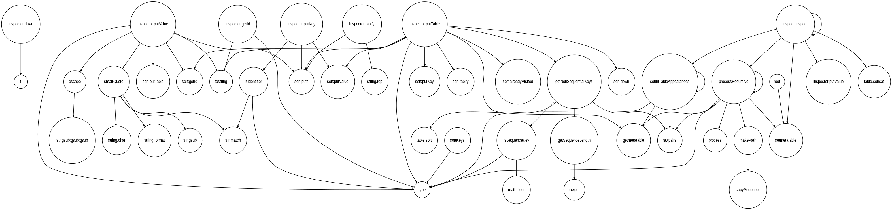

# ANTLRv4 Lua parser and lexer grammars

Modified https://github.com/antlr/grammars-v4/tree/master/lua:

* split lexer and parser grammars
* added more statement types (varstat etc)
* added a COMMENTS channel
* whitespace goes to HIDDEN channel rather than simply skipping

## Usage

As for other ANTLRv4 grammars:

```shell
antlr4 LuaLexer.g4 LuaParser.g4
```

## Railroad Diagrams

See the grammar in the form of railroad diagrams [here](https://stevenjohnstone.github.io/lua-grammar/).

## Examples
### Generating a Callgraph

The following is a callgraph for [inspect.lua](https://github.com/kikito/inspect.lua):

.

On Linux with clang, graphviz and antlr4 [installed](https://www.antlr.org/):

```shell
cd examples/cpp/dot
make
```

Then

```shell
 wget -q https://raw.githubusercontent.com/kikito/inspect.lua/master/inspect.lua -O -|./callgraph |dot -T png -o inspect.png
 ```


